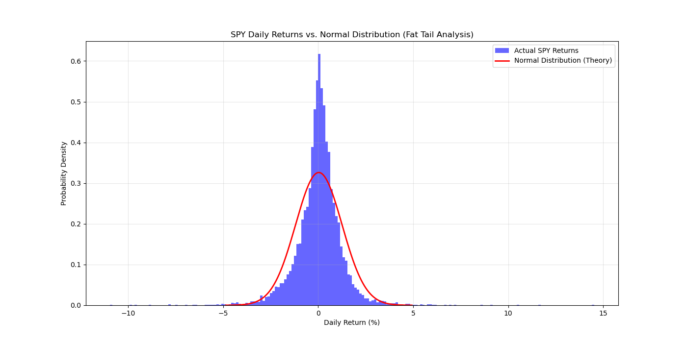

# S&P 500 Market Regime & Tail Risk Analysis

## 📊 Project Overview
**Objective:** To empirically validate the "Fat Tail" hypothesis in financial markets and challenge the Gaussian (Normal) assumption used in traditional risk models (e.g., Value at Risk, Black-Scholes).

**Context:** Standard financial theory often assumes asset returns are normally distributed. However, real-world market crashes occur far more frequently than a Bell Curve predicts. This project quantifies that discrepancy.

## 🧠 Key Findings (The Alpha)
My statistical analysis of 20+ years of S&P 500 data revealed two critical market regimes:
1.  **Leptokurtosis (Peaked Center):** The market is "boring" (low volatility) far more often than a normal distribution predicts.
2.  **Fat Tails (Extreme Risk):** Extreme outlier events (daily moves > 4% or < -4%) occur with significantly higher frequency than theoretical probabilities.

**Implication for Risk Management:**
Models relying on Standard Deviation alone will **underestimate** the risk of a market crash ("Black Swan" event).
s
## 📈 Visualization
*Blue Bars = Actual Market Reality | Red Line = Theoretical Normal Distribution*



## 🛠️ Methodology
1.  **Data Ingestion:** Fetched daily close prices for `SPY` (2000-Present) via the Yahoo Finance API.
2.  **Statistical Processing:** Calculated daily log-returns and derived the first two moments (Mean $\mu$ and Standard Deviation $\sigma$).
3.  **Modeling:** Generated a theoretical Probability Density Function (PDF) based on historical $\mu$ and $\sigma$.
4.  **Visualization:** Overlaid empirical data against the theoretical model to visually isolate tail risk.

## 💻 Tech Stack
* **Python:** Core logic.
* **Pandas/NumPy:** Vectorized data manipulation.
* **SciPy:** Statistical modeling (Normal Distribution PDF).
* **Matplotlib:** Data visualization.

## 🚀 How to Run
1.  Clone the repo:
    ```bash
    git clone [https://github.com/YOUR_USERNAME/market-regime-analysis.git](https://github.com/YOUR_USERNAME/market-regime-analysis.git)
    ```
2.  Install dependencies:
    ```bash
    pip install -r requirements.txt
    ```
3.  Run the analysis:
    ```bash
    python main.py
    ```